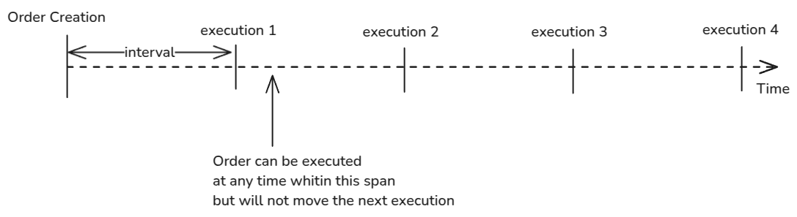
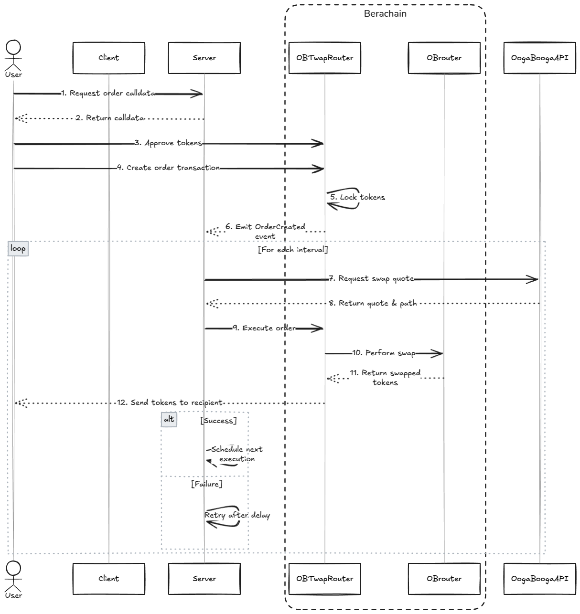

# Ooga booga Twap Backend

Functional Requirements

- Users must be able to specify both the time interval between trades and the total amount to be swapped at each interval
- Use the Ooga Booga API to swap available assets
- Create an API that users can directly interact with to create these orders. You may choose to have users submit the final transaction on-chain if you believe that's the best approach

## Design Considerations

- We are using NestJS for this project to take advantage of dependency injection, and assuming the project can grow, it will be easier to maintain. If the project would remain small, a more lightweight framework like Express would be preferred.
- The system has been designed in a way that it does not require extra infrastructure to run, like a database, a message queue, etc. These desicions are only because of the time constraints of this task.
- This server is not prepared for horizontal scaling.

## System Overview

The system was designed to be as simple as possible and to leverage the security and decentralization of the Berachain blockchain. The `OBTwapRouter` contract will ensure orders are executed correctly and according to the rules the user has set.

### Flow Summary:

1. User creates an order by directly sending a transaction to the OBTwapRouter contract. With the relevant parameters: 
    - **tokenIn**: The token to swap from
    - **tokenOut**: The token to swap to
    - **intervalSecs**: The time interval between trades
    - **orderAmountIn**: The amount of tokens to swap at each interval
    - **totalAmountIn**: The total amount of tokens to swap, should be a multiple of orderAmountIn
    - **recipient**: The address to send the swapped tokens to
    - **slippage**: The maximum slippage allowed for the swap
  
  >This transaction will pull the ERC20 tokens from the user's wallet and send them to the `OBTwapRouter` contract. (Note that another approach is to only require the user to give the contract approval to spend the tokens and then pull tokens on each execution, this avoids the need to lock the tokens in the contract. But this will require to handle the cases where the user removes approval or runs out of funds during the execution of the order)

2. The contract will ensure orders can only be executed if the interval time has passed from the last execution.
3. Anyone willing to pay the gas can execute an order as soon as it is in a valid state. (In this case, this server will do that job)
4. To execute an order, the executor should provide the coresponding `pathDefinition` for the `OBrouter` and call the `executeOrder` function in the `OBTwapRouter` contract.
5. The `OBrouter` will execute the swap and send the tokens to the recipient address.
6. When total amount of tokens has been swapped, the order is considered completed.

### Order Scheduling

There are several approaches to define **when** orders are able to be executed. The current design ensures that order are enabled for execution at **fixed intervals from the order creation**.
This means, no matter the actual timestamp of the real execution, the intervals will always be referenced from the order creation.



This is achieved by always setting the `last execution timestamp = previous execution timestamp + interval`.

Another possible approach is to set the `last execution timestamp = current timestamp`. But this will cause the intervals to be different depending on the execution time and potentially shifting the intervals.

> A Caveat of the current approach is that if the order is not executed within an interval, you can execute all missed intervals at once. This can be mitigated by modifying the logic to consider these not executed intervals as "lost" and not allow for succesive executions, this will cause the order to go on for a longer time until completing the total amount.

## Server Implementation

The server provides an endpoint that users can call to get the needed `calldata` to build a transaction for creating the order.

They user will then send the final transaction from the client, where they can sign it using their wallet. Before creating the order, the user must have approved the `OBTwapRouter` contract to spend the `tokenIn`.

When the the order is created, the server will pick up the event and schedule the next execution.

On each execution, the server will:
- Request a swap from the `Ooga Booga API`
- Use the quote to build the calldata for the `OBrouter`
- Send the transaction to the `OBTwapRouter` contract
- On success, it will schedule the next execution
- On failure, it will retry after a delay

On startup the server reads the active orders from the contract and schedule the next execution for each of them.



Execution is implemented using an in-memory queue that is processed by a single worker and waits for each transaction to be confirmed in order to avoid nonce collision. This can be improved by not waiting for the transaction to be confirmed and using a more sophisticated nonce tracking system.

## Project Structure

- `src/features/*`: Contains the logic for business logic features.
- `src/providers/*`: Contains the logic for providers (interfaces with external services).

## Critical things to improve for a production-ready system

- Proper validations and limits should be added. Improve error messages.
- Implement a `cancel order` feature.
- Add a database to keep a persistent state and allow for scaling.
- Add a distributed message queue to handle order execution more efficiently. This would allow to use any amount of wallets to execute orders and increase the throughput. For example, [BullMQ](https://docs.bullmq.io/) to use Redis as the distributed queue storage.
- Prepare the system for horizontal scaling.
- Add tests
- Add authentication
- Add features to allow users to see the state of their current orders.
- Add a feature to allow users to receive alerts for their orders.

## API Documentation

The API documentation (Autogenerated) is available at `http://localhost:3000/`.

## Project setup

```bash
$ yarn install
```

## Compile and run the project

```bash
# development
$ yarn run start

# watch mode
$ yarn run start:dev

# production mode
$ yarn run start:prod
```

## Run tests

```bash
# unit tests
$ yarn run test

# e2e tests
$ yarn run test:e2e

# test coverage
$ yarn run test:cov
```

## Create an order from a local wallet

```bash
$ yarn run create-order
```
